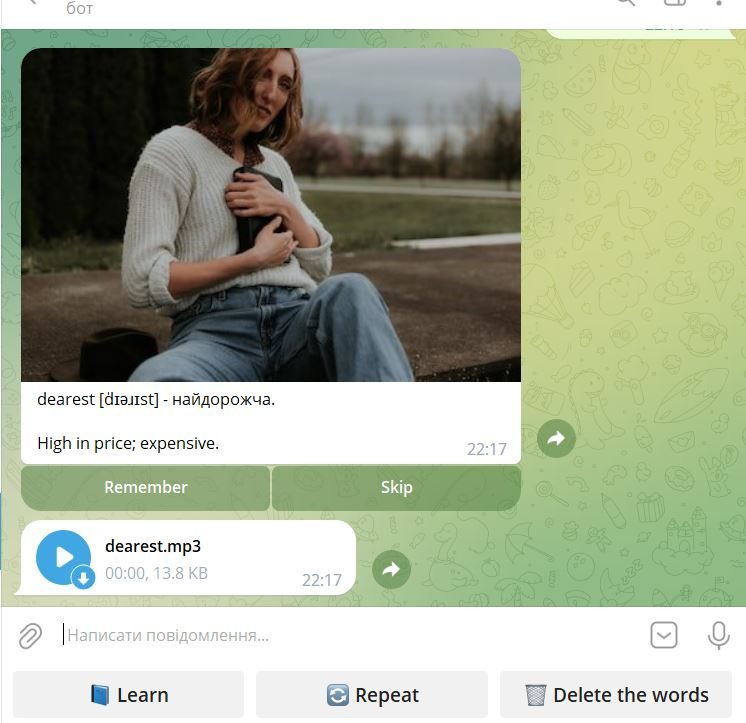
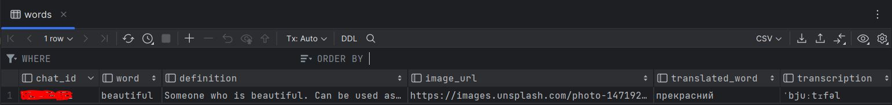

# English Telegram Bot
An example of developing a telegram bot from scratch using APIs: unsplash, deepl, rapidapi , voicerss and telegram

* Unsplash - https://unsplash.com/
* DeepL Translator - https://www.deepl.com/
* Rapid api - https://rapidapi.com/rokish/api/lingua-robot
 

 

* ✅ The bot uses the Lingua Robot library with 800 thousand English words. 
* ✅ Words from the library are extracted in random order and are not repeated if the word has already been added to the database as a word to repeat after learning. 
* ✅ Each word is accompanied by a picture that shows the meaning of the word thanks to the unsplash library. 
* ✅ For each word, a transcription is displayed, which is also available in the Lingua Robot library for each word. 
* ✅ Using to the DEEPL library, the translation of words into Ukrainian is displayed. 
* ✅ Using to the Lingua Robot library, I display the voice of the word that is being learned or repeated after learning.
* ✅ Words can be memorized (for later repetition) or skipped.
* ✅ The database contains the words being studied, their transcription, a link to a picture, definition, and the user's chat_id.
* ✅ Repetition of words occurs from words that have been previously saved.
* ✅ The user can delete all the words he has learned from the database ( those that have been saved for repetition)
* ✅ Only one image with text and audio is displayed and stored in the chat, when new words are displayed, the previous value is deleted from the chat display
* ✅ Words that are skipped are recorded in the database so that they are no longer duplicated until the user clears the database of learned words
 

 

> This is what the bot will look like. 

 

> An example of how saved words are displayed in a sqlite database.

